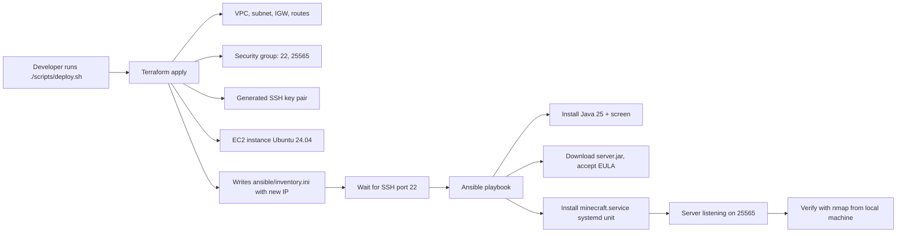

# Minecraft Server on AWS — Infrastructure as Code

Fully automated configuration, and deployment of a Minecraft
Java Edition server on AWS, using **Terraform** for infrastructure and
**Ansible** for configuration. The entire pipeline runs from a single command
— no AWS Management Console, no manual SSH.

CS 312 System Administration — Course Project Part 2

## Background

In Course Project Part 1, the Minecraft server was deployed manually: clicking
through the AWS Console, SSHing into the instance, and installing everything
by hand. That works once, but it does not scale, is not reproducible, and the
documentation goes the moment anything changes.

This project replaces the manual process with Infrastructure as Code:

- **Terraform** declares all AWS resources (VPC, subnet, internet gateway,
  route table, security group, SSH key pair, EC2 instance) in versioned
  `.tf` files. `terraform apply` builds them; `terraform destroy` removes them.
- **Ansible** configures the instance: installs Java 25, downloads the pinned
  Minecraft server jar, accepts the EULA, and installs a systemd service.
- A **bash script** (`scripts/deploy.sh`) orchestrates the two stages and
  waits for the server to actually accept connections before reporting success.

The systemd service fixes the previous deployment's two operational problems:

1. **Auto-restart** — `WantedBy=multi-user.target` starts the server on every
   boot, and `Restart=on-failure` restarts it after crashes.
2. **Graceful shutdown** — the old setup killed the Java process, which could
   lose world data. Here, the server runs inside a `screen` session and
   `ExecStop` runs `stop.sh`, which sends the in-game `stop` command to the
   console so the world saves before the process exits.

## Pipeline Overview



Terraform creates the network and the instance, then writes the
instance's public IP into the Ansible inventory. The deploy script waits until
SSH answers, then Ansible installs and starts the Minecraft service. The
playbook's final task blocks until port 25565 is listening, so when the script
prints "complete," the server is genuinely joinable.

## Requirements

| Tool | Tested version | Purpose |
|---|---|---|
| [Terraform](https://developer.hashicorp.com/terraform/install) | 1.15.5 | Provision AWS infrastructure |
| [Ansible](https://docs.ansible.com/ansible/latest/installation_guide/) | 14.0.0 (core 2.21) | Configure the EC2 instance |
| [AWS CLI v2](https://docs.aws.amazon.com/cli/latest/userguide/getting-started-install.html) | 2.35.0 | Credential check, optional instance actions |
| [nmap](https://nmap.org/) | 7.99 | Verify the Minecraft service from outside |
| `nc` (netcat) | preinstalled on macOS/Linux | SSH readiness check in `deploy.sh` |

On macOS: `brew install awscli ansible nmap` and
`brew tap hashicorp/tap && brew install hashicorp/tap/terraform`.

### Credentials

This project targets an **AWS Academy Learner Lab** account:

1. Start the lab, then open **AWS Details → AWS CLI: Show**.
2. Copy the `[default]` block (access key, secret key, session token) into
   `~/.aws/credentials`.
3. Set the region in `~/.aws/config`:

```ini
   [default]
   region = us-east-1
```

4. `aws sts get-caller-identity` should print your account.

> **Note:** Learner Lab credentials expire when the session ends. If Terraform
> reports an authentication error, re-copy fresh credentials.

No other configuration is needed — the SSH key pair and the Ansible inventory
are generated automatically by Terraform.

## Repository Structure

```
minecraft-iac/
├── README.md
├── .gitignore             # excludes state, keys, generated inventory
├── terraform/
│   ├── provider.tf        # required providers (aws, tls, local) + region
│   ├── variable.tf        # region, instance type, port, name prefix
│   ├── main.tf            # VPC, subnet, IGW, SG, key pair, EC2, inventory
│   └── output.tf          # public IP, instance ID, ready-made nmap command
├── ansible/
│   ├── ansible.cfg        # inventory path, disable host key prompt
│   ├── minecraft.yml      # the configuration playbook
│   └── files/
│       ├── minecraft.service   # systemd unit (auto-start + graceful stop)
│       ├── stop.sh             # sends "stop" to the server console
│       └── server.properties   # initial server settings (seeded once)
└── scripts/
    ├── deploy.sh          # full pipeline: terraform -> wait -> ansible
    └── destroy.sh         # tear down all AWS resources
```

Generated at deploy time (gitignored): `ansible/inventory.ini`,
`ansible/minecraft_key.pem`, `terraform/terraform.tfstate`.

## Usage

### Deploy everything

```bash
./scripts/deploy.sh
```

This runs, in order:

1. `terraform -chdir=terraform init` — download/verify providers.
2. `terraform -chdir=terraform apply -auto-approve` — create all 11 resources.
3. A `nc` loop that waits for the new instance's SSH port to open.
4. `ansible-playbook minecraft.yml` — configure and start the server.

Takes roughly 5–6 minutes; about half is the Minecraft server generating its
world on first boot. The script ends by printing the verification command.

### Verify

From your local machine replace the IP with the one the script printed:

```bash
nmap -sV -Pn -p T:25565 <instance_public_ip>
```

Expected output includes the service banner, for example:

```
25565/tcp open  minecraft Minecraft 26.1.2 (... Users: 0/20)
```

### Verify auto-restart 

```bash
aws ec2 reboot-instances --instance-ids $(terraform -chdir=terraform output -raw instance_id)
# wait ~2-3 minutes for boot + world load, then re-run the nmap command
```

The port reopens without any manual intervention, proving the systemd
auto-start works.

### Re-running

Both tools converge on the declared state instead of redoing work:
`terraform apply` on unchanged config reports nothing to do, and a second
`ansible-playbook minecraft.yml` run ends with `changed=0`.

### Tear everything down

```bash
./scripts/destroy.sh
```

Deletes all 11 AWS resources (including the world data on the instance's disk).

## How to Connect to the Minecraft Server

1. Get the IP: it is printed at the end of `deploy.sh`, or run
   `terraform -chdir=terraform output -raw instance_public_ip`.
2. Open **Minecraft Java Edition** (client version 26.1.2 to match the server).
3. **Multiplayer → Add Server**, paste the public IP, join.

The `nmap` command above confirms the server is up and
reports its version, MOTD, and player count.

## Resources / Sources

- [Terraform AWS provider documentation](https://registry.terraform.io/providers/hashicorp/aws/latest/docs)
- [Ansible builtin modules documentation](https://docs.ansible.com/ansible/latest/collections/ansible/builtin/)
- [systemd.service documentation](https://www.freedesktop.org/software/systemd/man/systemd.service.html)
- [Minecraft server download (Mojang)](https://www.minecraft.net/en-us/download/server)
- [Minecraft Wiki — Setting up a server](https://minecraft.wiki/w/Tutorial:Setting_up_a_Java_Edition_server)
- [GNU screen manual](https://www.gnu.org/software/screen/manual/) (console injection for graceful stop)

